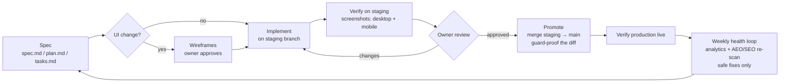

# website-forge

**A toolkit you hand to your own AI assistant to build and run a small-business website the way Axiovex Systems does it — GitHub as the source of truth, Cloudflare Pages as the host, specs before code, staging before production, and SEO/AEO held near 100 by a weekly loop.**

No host to find. No server to patch. No per-gigabyte meter running on your visitors.

## Give this to your AI

### Claude Code (recommended — it can edit files, run the MCP server, and deploy previews)
1. Clone this repo next to your website repo.
2. Copy `docs/AGENT-INSTRUCTIONS.md` into your website repo as both `AGENTS.md` and `CLAUDE.md`.
3. Copy `skill/` into your website repo at `.muse/skills/website-forge/`.
4. Install the MCP server (`mcp-server/README.md`) and run its self-test once.
5. Open Claude Code in your website repo and say:
   > "Read AGENTS.md and the website-forge package. Audit my site with the MCP tools, write the spec for Phase 1, and stop for my review before changing anything."

### Cursor / VS Code / other coding agents
Same files, same order: `AGENT-INSTRUCTIONS.md` as your rules file, `skill/SKILL.md` as the workflow, `prompts/MASTER-PROMPT.md` as your first message.

### ChatGPT (planning and copy)
Upload the Markdown files from this repo and paste `prompts/MASTER-PROMPT.md`. Use ChatGPT to plan, draft, and review; pair it with a coding agent for the actual file edits and the MCP server — a chat window alone can't run a local MCP server or edit your repo.

## What's inside

| Folder | What it is |
|---|---|
| `skill/` | The reusable Skill: forced requirements, a task index, and seven deep references (governance, staging & promotion, SEO/AEO, visual verification, analytics reporting, costs, newsletter) |
| `mcp-server/` | A small MCP server (Python, FastMCP, no API keys) with audit, discovery, header, page-check, and generator tools for robots/sitemap/llms — self-test included |
| `templates/` | Drop-in starters: robots.txt (AI crawlers allowed), sitemap.xml, llms.txt, Netlify/Cloudflare `_headers`, a full `<head>` snippet, JSON-LD (Organization, Article, FAQ), a blog-post template, `.gitignore`, and a GitHub Actions build-sync workflow |
| `docs/` | Getting started, agent instructions, checklists, the verified cost comparison, and per-phase prompts |
| `examples/` | A filled-in llms.txt and a complete worked spec for "add a blog article" |
| `AUDIT` method | The same audit → fix → verify loop we run on our own site, which holds AEO 100/100 and ~90% SEO in independent checks |

## The method

Three rules carry most of the weight:

1. **Spec first, wireframes before UI.** The owner approves the plan — and the drawing, if the change is visible — before anyone builds.
2. **Staging is the first place anything renders.** Production is promoted to, never experimented on. Staging's search-blocking guard files never cross into production (there is a checklist for proving that).
3. **Verified means rendered.** A change is done when a fresh scanner run, a live fetch, and screenshots at desktop and mobile widths say so — never when the source code merely looks right.

## Cost philosophy

A business website is pages written once and read many times. It does not need an application platform:

- **GitHub** holds the files: free for this purpose, and the site is never trapped — it's plain files in a repository.
- **Cloudflare Pages** delivers them: free plan, unlimited unmetered bandwidth for static assets, 500 builds a month, SSL and a firewall included.
- **The domain** is the main recurring cost: roughly $10 a year bought at cost through a registrar.
- The big clouds meter exactly what a successful website uses most — visitors. A modeled terabyte month costs about $189 on Azure's static plan; it costs $0 here. Full verified comparison: `docs/COSTS.md`.

Where a real application backend, a named-cloud compliance regime, or library-scale video enters the picture, host *that project* on AWS or Azure — and keep the website here. The method states its own boundary.

## Who made this

Published by **Axiovex Systems, LLC** — a Michigan engineering consultancy. This is the sanitized, generalized version of the operating system behind axiovexsystems.com and client sites built the same way. Questions: start@axiovexsystems.com

## License

MIT — see [LICENSE](LICENSE). Use it, fork it, ship client sites with it. Attribution appreciated, not required beyond the license.
